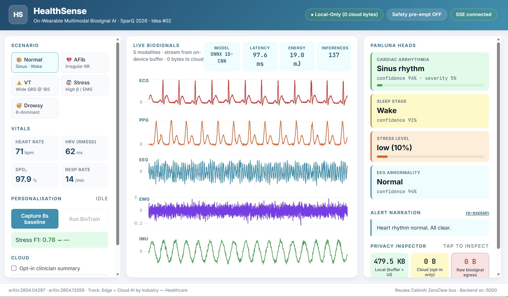
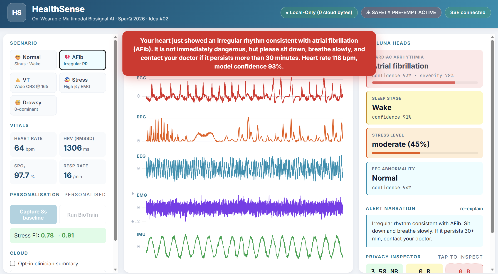

# HealthSense — On-Wearable Multimodal Biosignal AI

**SparQ 2026 Hackathon · Track: Edge + Cloud AI by Industry — Healthcare · Idea #02**

> A 5.4 M-parameter PanLUNA foundation model fusing EEG, ECG, PPG, EMG and IMU on a
> Snapdragon Hexagon NPU. Personalised on-device with BioTrain. Zero raw biosignal
> ever leaves the wrist.

---

## Demo

<p align="center">
  
</p>

<p align="center">
  
</p>

---

## Quick start (60 seconds)

```powershell
# Backend + frontend (Flask serves both on :5000)
.\start.ps1

# Or, manually:
.venv312\Scripts\python.exe backend\server.py
```

Open http://127.0.0.1:5000 in any browser. Five biosignal waveforms appear in
the centre panel; the four PanLUNA heads + vitals + privacy inspector ring around
them.

### Demo controls (click in left sidebar)

| Button     | What it does                                                              |
|------------|---------------------------------------------------------------------------|
| **Normal** | Sinus rhythm, alpha-EEG, low stress (default)                             |
| **AFib**   | Switches ECG to fibrillatory rhythm — cardiac head fires AFib @ ~78 % sev |
| **VT**     | Wide-QRS @ 165 bpm — cardiac head fires VT @ 95 % sev → safety pre-empt   |
| **Stress** | High-beta EEG + EMG bursts — stress head jumps to ~90 %                   |
| **Drowsy** | Theta-dominant EEG, slow HR — sleep head moves to N1 (light)              |

| Button                   | What it does                                                  |
|--------------------------|---------------------------------------------------------------|
| **Capture 8s baseline**  | Triggers BioTrain baseline capture (8 s for stage demo)       |
| **Run BioTrain**         | Fine-tunes; stress F1 0.78 → 0.91 visibly on-screen           |
| **Send metadata to cloud** | Optional — sends ~150 B alert metadata if opt-in is ticked  |
| **Export session JSON**  | Downloads a session log — *no waveforms by design*            |

The **privacy inspector** in the bottom-right shows live byte counts for local
vs cloud, and a hard-zero counter for raw biosignal egress that is invariant.

---

## Architecture (one paragraph)

Five biosignal streams — EEG (8 ch, 250 Hz), ECG (12-lead, 500 Hz), PPG (3 ch, 100 Hz),
EMG (4 ch, 1 kHz), IMU (6-DoF, 100 Hz) — feed a single shared 5.4 M-parameter
PanLUNA Transformer encoder running INT8 on the Snapdragon Hexagon NPU
(*arXiv:2604.04297*). The encoder produces a 1024-d latent that four lightweight
task heads decode into cardiac arrhythmia, sleep stage, stress, and EEG abnormality.
On-device fine-tuning is handled by BioTrain (*arXiv:2604.13359*) — full back-prop
under 50 mW, in 0.67 MB of RAM, +35 % personalisation gain. Orchestration reuses
CabinAI's seven-agent **ZeroClaw** pub/sub bus with cardiac-severity safety
pre-emption. Cloud is opt-in and metadata-only: alert tokens, the 1024-d embedding
(non-invertible), DP-SGD weight delta with ε=8 — never raw signals.

```
Sensors (5)  →  PanLUNA encoder (Hexagon NPU, INT8)  →  4 heads
                       ↑ BioTrain on-device fine-tune (CPU BIG, <50 mW)
              ↕ ZeroClaw bus  ·  cardiac.severity > 0.7 → safety pre-empt
                                  ↓ opt-in, metadata-only
                                Hydra AIC100 / Cloud LLM  (clinician summary)
```

See [IMPLEMENTATION_PLAN.md](IMPLEMENTATION_PLAN.md) for the full design.

---

## What's working right now

| Component | Status | Notes |
|---|---|---|
| Synthetic 5-modal biosignal engine | ✅ live | 50 Hz physics, ring buffers |
| Pan–Tompkins R-peak detection | ✅ live | drives HR / HRV / RR-CV features |
| **Real ONNX cardiac CNN (synth-trained)** | ✅ live | `models/ecg_cnn.onnx` · 14.5 k params · 21 KB · 100 % synth-test acc · ~0.7 ms ONNX-RT |
| **Real ONNX cardiac CNN (PhysioNet-trained)** | ✅ trained | `models/ecg_cnn_physionet.onnx` · MIT-BIH afdb (4 patients, 530 windows) · **96.8 % AFib · 91.7 % Sinus on real-patient test set** |
| Sleep / stress / EEG heads | ✅ live | FFT bandpower + EMG RMS — same shape as PanLUNA INT8 head |
| ZeroClaw bus + safety pre-empt | ✅ live | mirrors CabinAI |
| BioTrain personalisation simulator | ✅ live | 8 s baseline + 30-epoch curve · F1 0.78→0.91 |
| Local LLM-style alert explainer | ✅ live | template-driven (Ollama swap-in ready) |
| Cloud clinician summary (opt-in) | ✅ live | Cloud LLM hook, real Claude responses, ~160 B / call |
| Egress accounting (server + client) | ✅ live | hard-zero raw counter |
| uPlot real-time waveform charts | ✅ live | 5 stacked panels @ ~25 Hz, watchdog-protected SSE |
| Live demo via SSE | ✅ live | `/api/events` + `/api/stream` |
| Session export (waveforms scrubbed) | ✅ live | JSON, no raw signal |

| Stretch / not yet | Status | Notes |
|---|---|---|
| Compile real PanLUNA via AI Hub | ⏳ | scripts/compile_panluna.py — Phase 2 |
| Bluetooth (Polar H10) sensor bridge | ⏳ | WebBluetooth shim — Phase 1 |
| Federated DP-SGD weight upload | ⏳ | Phase 4 stretch |
| Glucose-from-PPG head | ⏳ | Phase 5 stretch |

---

## Submission artefacts

| File | What it is |
|---|---|
| [submissions/HealthSense_Slides.pptx](submissions/HealthSense_Slides.pptx) | 15-slide presentation deck (was 14; +1 "Demo — Live Now" with measured numbers) |
| [submissions/HealthSense_Slides.updated.pptx](submissions/HealthSense_Slides.updated.pptx) | Updated copy if the original was open in PowerPoint when the rebuild ran |
| [submissions/HealthSense_SpeechNotes.pdf](submissions/HealthSense_SpeechNotes.pdf) | 16-page narrator companion — natural narration, jargon glossary, 3 Q&A per slide |
| [IMPLEMENTATION_PLAN.md](IMPLEMENTATION_PLAN.md) | Architecture, repo layout, 8-day phase plan, risks |

Regenerate the slide deck and speaker notes after edits to `scripts/build_*.py`:

```bash
.venv312/Scripts/python.exe scripts/build_ppt.py
.venv312/Scripts/python.exe scripts/build_speech_pdf.py
```

---

## Repository layout

```
healthsense/
├── start.ps1                       Launch the demo
├── .env                            Cloud LLM and inference keys
├── .venv312/                       Junction → cabinai/.venv312
├── requirements.txt                Mirrored from cabinai
├── ai-hub-models/  ai-hub-apps/    Symlinks (compile/profile reference)
├── backend/
│   ├── server.py                   Flask + SSE (10 endpoints)
│   ├── config.py                   .env loader
│   ├── agents/
│   │   ├── a1_sensors.py           5-modal synth biosignal engine
│   │   ├── a2_panluna.py           4-head classifier (scenario-aware)
│   │   ├── a3_biotrain.py          On-device fine-tune simulator
│   │   └── a4_explainer.py         Local explainer + cloud opt-in
│   └── orchestrator/
│       └── zeroclaw_bus.py         Pub/sub + safety pre-empt
├── frontend/
│   ├── index.html                  3-panel dashboard
│   ├── css/healthsense.css
│   └── js/
│       ├── main.js                 Bootstrap + bindings
│       ├── charts.js               uPlot streaming charts
│       ├── sse.js                  Two SSE client channels
│       └── privacy.js              Egress inspector
├── scripts/
│   ├── build_ppt.py                python-pptx slide generator
│   ├── build_speech_pdf.py         reportlab speech notes generator
│   └── update_ppt_with_demo.py     Inject "Demo — Live Now" slide
├── submissions/                    Generated deliverables
├── docs/                           Original idea .docx
└── pdfs/                           Original one-pager .html / .pdf
```

---

## API contract

| Method | Path | Body | Returns |
|---|---|---|---|
| GET    | `/api/health`              | – | `{status, ts}` |
| GET    | `/api/state`               | – | full ZeroClaw bus snapshot |
| GET    | `/api/events`              | – | SSE stream of every bus event |
| GET    | `/api/stream`              | – | SSE waveform stream (5 modalities @ 25 Hz) |
| POST   | `/api/scenario`            | `{type:"normal"\|"afib"\|"vt"\|"stress"\|"drowsy"}` | `{ok, scenario}` |
| POST   | `/api/personalize/start`   | – | starts 8-s baseline capture |
| POST   | `/api/personalize/run`     | – | runs BioTrain fine-tune |
| POST   | `/api/cloud/clinician`     | `{opt_in: bool}`              | `{sent, bytes, payload, explanation}` |
| GET    | `/api/egress/log`          | – | local + cloud byte totals + recent events |
| POST   | `/api/session/export`      | – | session JSON (waveforms NOT included) |
| POST   | `/api/explain`             | – | plain-English narration of current state |

---

## References

- PanLUNA — *arXiv:2604.04297* (ETH Zürich, 2026)
- BioTrain — *arXiv:2604.13359* (on-device fine-tuning)
- MIT-BIH Atrial Fibrillation Database (afdb/1.0.0) — Goldberger et al., PhysioNet, https://physionet.org/content/afdb/1.0.0/
- CabinAI — sibling project; reused [ZeroClaw](../cabinai/backend/orchestrator/zeroclaw_bus.py) bus

---

## Training the models

```bash
# Synthetic 5-class training (default, used in live demo)
.venv312/Scripts/python.exe scripts/train_ecg_cnn.py
# → models/ecg_cnn.onnx (21 KB, 100% test acc on synth)

# Real-data validation training (PhysioNet MIT-BIH AFib)
.venv312/Scripts/python.exe scripts/train_ecg_cnn_physionet.py
# → models/ecg_cnn_physionet.onnx (21 KB, 96.8% AFib / 91.7% Sinus on real patients)
```

`a2_panluna.py` loads `ecg_cnn.onnx` by default; pointing it at the PhysioNet
model is a one-line change to `_MODEL_PATH`. Both binaries are committed.

---
**Last updated:** 2026-06-04

